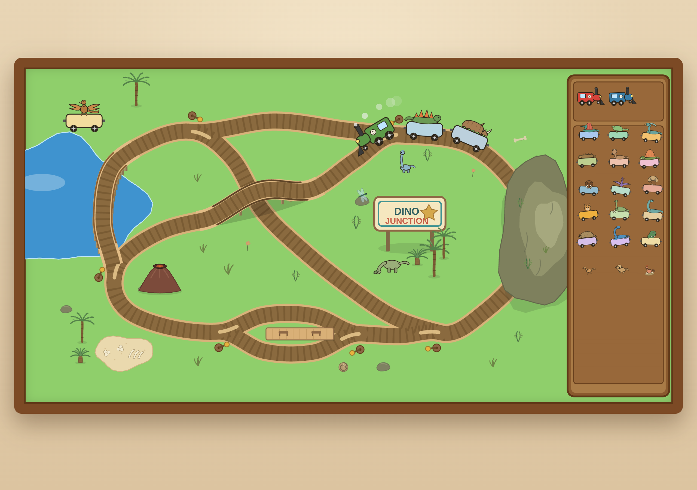

# Dino Junction

Exactly what it sounds like: a train table where the cars are dinosaurs
(or other prehistoric animals).

**Play it here: <https://brezgis.com/dino-train-table/>**



An ambient browser toy. You open the page and you're sitting at a wooden
train table: a couple of trains are already trundling around, and the rest
of the animals wait in the tray at the side. No goals, no score, no settings.

## Quickstart

Plain SVG and one script. No dependencies, no build.

```sh
git clone https://github.com/brezgis/dino-train-table.git
cd dino-train-table
```

Then either open `index.html` straight from disk, or serve the folder with
any static server:

```sh
python3 -m http.server
# → http://localhost:8000
```

## Things a hand can do

- **Pick anything up** and put it somewhere else — on a rail, on the felt,
  or back in the tray. The wild dinosaurs grazing on the felt move too.
- **Tap an engine** and its whole train turns around and heads back the
  other way.
- **Tap an animal** and a little caption below the table introduces it.
  Each one chimes its own note when picked up.
- **Tap a switch lever** (the yellow-knobbed pins at the junctions) to choose
  where the track sends the trains.
- Drop cars **behind** an engine and they couple on. Leave them **in front**
  and the engine has to push — too many and it bogs down, puffing hard.
- Two trains meeting nose-to-nose will argue about it for a moment.
  The smaller one backs down.
- A lever flipped under a moving train splits it. This is a feature, as
  anyone who grew up with a wooden train set knows.
- The volcano is mostly dormant. Mostly.

## License

[MIT](LICENSE).
